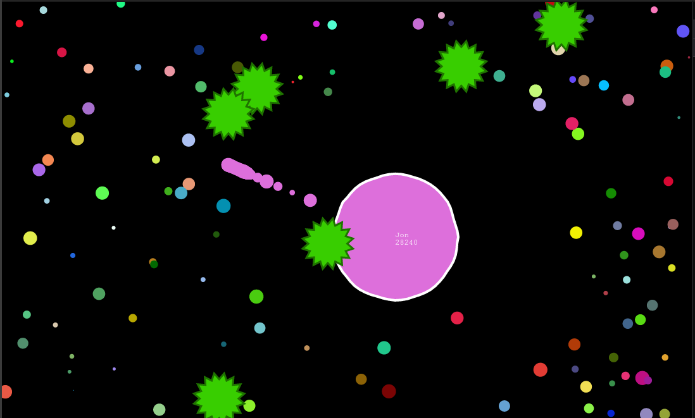

# fragar.io

Implemented:
- self collision
- proper splitting / spawning
- proper merging
- mass
- movement
- jelly cell border

## Demo
[GitHub Pages Demo](https://repcomm.github.io/fragar.io)

## Building
- clone this repo
- navigate inside cloned directory
- `npm install` to install dependencies
- `npm run build` to compile TS to JS
- serve ./docs/ directory from a http(s) server
- Open the hosted site in your browser

## Controls
Split - double click/tap, or single spacebar
Move - move cursor, drag touch, or tap touch destination
